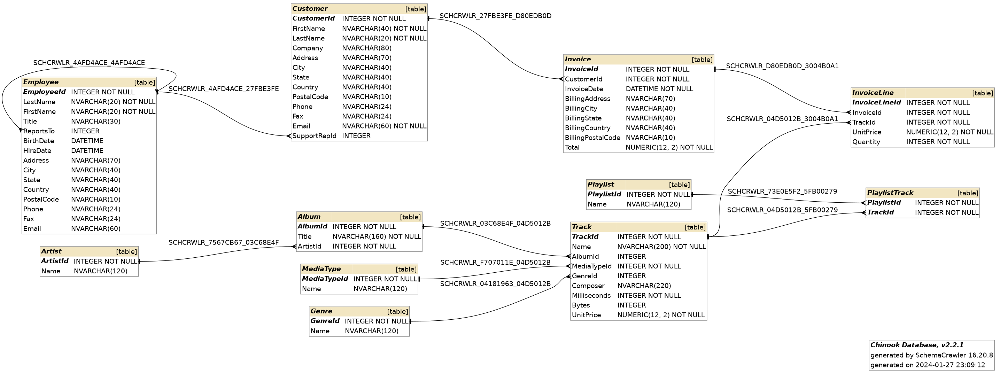

# Chinook Database for Java

> [Chinook database][chinook-database] packaged as a jar, for use in Java and with Testcontainers

## About

Chinook Database for Java takes the [Chinook database][chinook-database] SQL scripts created by [Luis Rocha](https://github.com/lerocha), and packages them as UTF-8 resources in a Java jar file. This jar can be [downloaded from The Central Repository][download] for use in Java programs, and for testing using [Testcontainers][testcontainers].

Supported database servers
- Microsoft SQL Server
- MySQL
- Oracle
- PostgreSQL
- SQLite
- IBM DB2

## How to Use

### Use as SQL Scripts

Download the jar from [The Central Repository][download], and unzip using a standard unzip program. The scripts will be in a directory called `chinook-database`.

### Use as Java Resources

[Reference the jar file in your Maven or Gradle project](https://search.maven.org/artifact/us.fatehi/chinook-database/2.1.2/jar), and load the SQL scripts as resources in your program.

### Use with Testcontainers

Take a look at the [unit tests](https://github.com/schemacrawler/chinook-database/tree/master/src/test) to see how to create the Chinook database in [Testcontainers][testcontainers].

### Use as SQLite Database

Download the Chinook SQLite database from the [project releases page](https://github.com/schemacrawler/chinook-database/releases).

### Use as Docker Container

The Chinook database Docker image is [published on Docker Hub](https://hub.docker.com/r/schemacrawler/chinook-database). You can use this with Docker Compose to create the Chinook database in any container that is running a database. Connect to your Docker container using a command like:
```sh
docker run -it schemacrawler/chinook-database /bin/bash
```
and then run `chinook-database-creator` with a command like:
```sh
chinook-database-creator \
--url "jdbc:postgresql://postgresql:5432/schemacrawler" \
--user schemacrawler --password schemacrawler
```

-----




[chinook-database]: https://github.com/lerocha/chinook-database "Chinook database"
[download]: https://search.maven.org/search?q=us.fatehi%20chinook "The Central Repository"
[testcontainers]: https://www.testcontainers.org/ "Testcontainers"
